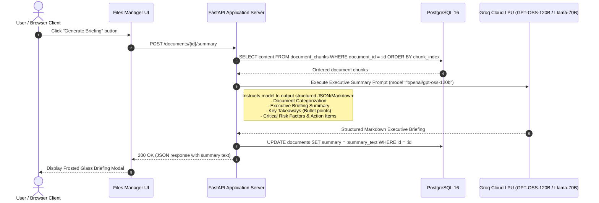
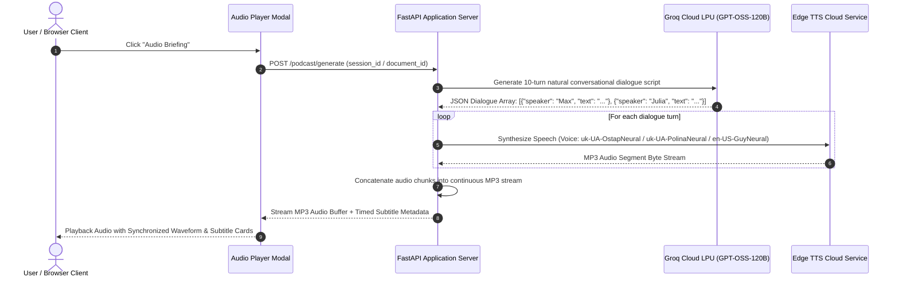

# Vectrieve AI — Enterprise Architecture Sequence Diagrams (UML)

This document provides formal, technical UML Sequence Diagrams specifying the end-to-end execution flows in **Vectrieve AI**:
1. **User Authentication & Workspace Provisioning**
2. **Multi-Format Document Ingestion & FastEmbed Vectorization**
3. **Hybrid RAG Query, Cross-Encoder Reranking & SSE Streaming**
4. **AI Executive Briefing Generation**
5. **Two-Host Audio Overview Synthesis**

---

## 1. End-to-End System Execution Sequence Diagram

```mermaid
sequenceDiagram
    autonumber
    actor Client as User / Browser Client
    participant Frontend as Next.js 16 (Turbopack)
    participant Gateway as FastAPI Application Server
    participant AuthGuard as Auth & Quota Middleware
    participant Ingestion as Ingestion Engine (Multi-Format)
    participant FastEmbed as FastEmbed Runtime (ONNX 768d)
    participant Qdrant as Qdrant Vector Engine
    participant Postgres as PostgreSQL 16
    participant CrossEncoder as Cross-Encoder Reranker
    participant GroqCloud as Groq Cloud LPU (GPT-OSS-120B)

    %% -------------------------------------------------------------
    %% SECTION 1: AUTH & WORKSPACE PROVISIONING
    %% -------------------------------------------------------------
    rect rgb(24, 27, 36)
    note over Client, Postgres: 1. Authentication & Workspace Session Initialization
    Client->>Frontend: Submit credentials (Email, Password)
    Frontend->>Gateway: POST /auth/login (email, password)
    Gateway->>Postgres: SELECT * FROM users WHERE email = :email
    Postgres-->>Gateway: User record, password hash, user_settings
    Gateway->>Gateway: Verify Argon2/Bcrypt hash & generate JWT
    Gateway->>Postgres: SELECT s.* FROM spaces s JOIN space_members m ON s.id = m.space_id WHERE m.user_id = :user_id
    Postgres-->>Gateway: List of accessible workspaces & roles (Owner, Editor, Viewer)
    Gateway-->>Frontend: Set-Cookie: access_token (HttpOnly, SameSite=Lax) + User payload
    Frontend-->>Client: Render Dashboard View (Cloud Enterprise, Persona Selector)
    end

    %% -------------------------------------------------------------
    %% SECTION 2: DOCUMENT INGESTION & VECTORIZATION
    %% -------------------------------------------------------------
    rect rgb(20, 32, 28)
    note over Client, Qdrant: 2. Multi-Format Document Ingestion Pipeline
    Client->>Frontend: Upload file (.pdf, .docx, .xlsx, .csv, .md, .txt)
    Frontend->>Gateway: POST /documents/upload (file, space_id)
    Gateway->>AuthGuard: Verify Space Member Role >= Editor
    AuthGuard-->>Gateway: Authorization Confirmed
    Gateway->>Ingestion: Parse file stream (Auto-detect encoding: UTF-8 / Windows-1251)
    Ingestion->>Ingestion: Semantic chunking (chunk_size=500, overlap=50)
    Ingestion->>Postgres: INSERT INTO documents & INSERT INTO document_chunks
    Postgres-->>Ingestion: Persisted chunk IDs & metadata
    Ingestion->>FastEmbed: TextEmbedding.embed(chunks, batch_size=16)
    FastEmbed-->>Ingestion: 768-dimensional dense float vectors (~180ms/chunk)
    Ingestion->>Qdrant: Upsert Points (collection="Vectrieve_knowledge", vectors, payload)
    Qdrant-->>Ingestion: HTTP 200 (Indexed points confirmed)
    Ingestion->>Postgres: UPDATE documents SET status="COMPLETED", vector_status="INDEXED"
    Ingestion-->>Gateway: Ingestion completed successfully
    Gateway-->>Frontend: 200 OK (Document metadata, chunk count, file size)
    Frontend-->>Client: Update File Manager Table & Badge State
    end

    %% -------------------------------------------------------------
    %% SECTION 3: HYBRID RAG QUERY & SSE STREAMING
    %% -------------------------------------------------------------
    rect rgb(34, 24, 40)
    note over Client, GroqCloud: 3. Hybrid Retrieval-Augmented Generation (RAG) & SSE Stream
    Client->>Frontend: Submit prompt ("What are the internship requirements?")
    Frontend->>Gateway: POST /chat/stream (query, session_id, space_id, persona)
    
    Gateway->>AuthGuard: Resolve Groq API Key & Quota Limits
    alt Using Shared Server Key (Trial Mode)
        AuthGuard->>Postgres: SELECT trial_queries_used FROM user_settings WHERE user_id = :uid
        Postgres-->>AuthGuard: trial_queries_used (e.g. 3 / 20)
        AuthGuard->>Postgres: UPDATE user_settings SET trial_queries_used = trial_queries_used + 1
    else Using Custom User Key
        AuthGuard->>AuthGuard: Decrypt and apply user-provided Groq API key
    end
    AuthGuard-->>Gateway: Quota approved, continue execution

    par Parallel Dual-Stage Retrieval
        Gateway->>FastEmbed: Generate 768-dim query vector (nomic-embed-text-v1.5)
        FastEmbed-->>Gateway: Dense float vector
        Gateway->>Qdrant: Dense Vector Search (Cosine distance, limit=20, filter={space_id})
        Qdrant-->>Gateway: Top-20 Dense Semantic Chunks + Scores
    and
        Gateway->>Postgres: Sparse Lexical Full-Text Search (ts_query on document_chunks)
        Postgres-->>Gateway: Top-20 Exact Keyword Match Chunks
    end

    Gateway->>CrossEncoder: Rerank Candidate Chunks (ms-marco-MiniLM-L-6-v2)
    CrossEncoder-->>Gateway: Filtered Top-5 Authoritative Passages (Score >= 0.45)

    Gateway->>Gateway: Assemble 4-Layer Hierarchical Prompt:
    note right of Gateway: Layer 1: Core System Grounding & Strict Citation Invariants<br/>Layer 2: Space Domain Definition (e.g. Animafest Program)<br/>Layer 3: Behavioral Persona Preset (Mentor / Auditor)<br/>Layer 4: Top-5 Context Evidence Chunks<br/>Layer 5: Multi-Turn Conversation History (Trimmed to token budget)

    Gateway->>GroqCloud: POST /chat/completions (model="openai/gpt-oss-120b", stream=true)
    GroqCloud-->>Gateway: Server-Sent Events (SSE Token Stream @ ~200 tokens/sec)
    
    loop Realtime SSE Token Streaming
        Gateway-->>Frontend: data: {"token": "...", "citations": [{doc_id, filename, score}]}
        Frontend-->>Client: Progressive Markdown Render + Verified Citations
    end

    par Asynchronous Background Tasks (asyncio.create_task)
        Gateway->>Postgres: INSERT INTO chat_history (session_id, user_id, role, content)
        Gateway->>Postgres: INSERT INTO telemetry_logs (dense_ms, sparse_ms, rerank_ms, llm_ms, tps)
        opt First Message in Chat Session
            Gateway->>GroqCloud: Generate concise title via llama-3.3-70b-versatile (2-4 words)
            GroqCloud-->>Gateway: "Internship Requirements Overview"
            Gateway->>Postgres: UPDATE chat_sessions SET title = :title WHERE id = :session_id
            Gateway-->>Frontend: Custom DOM Event: "refresh-sessions"
            Frontend-->>Client: Sidebar Session Title updates without page reload
        end
    end
    end
```

---

## 2. Document Executive Briefing Generation Sub-Flow

---

## 3. Two-Host Audio Overview / Podcast Flow (`edge_tts`)

