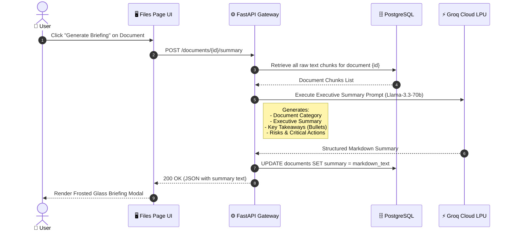
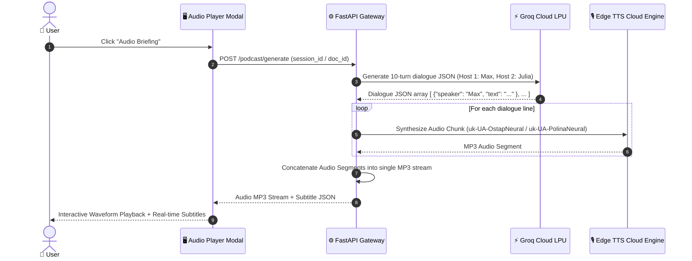

# 🏛️ Vectrieve AI — Complete Architecture Sequence Diagrams (UML)

This document provides end-to-end UML Sequence Diagrams illustrating every core lifecycle process in **Vectrieve AI**:
1. **User Authentication & Session Provisioning**
2. **Multi-Format Document Ingestion & FastEmbed Vectorization**
3. **Hybrid RAG Query, Cross-Encoder Reranking & SSE Token Streaming**
4. **AI Executive Briefing Generation**
5. **AI Two-Host Audio Podcast Overview (`edge_tts`)**

---

## 1. Complete End-to-End System Sequence Diagram

```mermaid
sequenceDiagram
    autonumber
    actor User as 👤 User / Client
    participant Frontend as 🖥️ Next.js 16 (Turbopack)
    participant Gateway as ⚙️ FastAPI Gateway
    participant Auth as 🔐 Auth & Quota Guard
    participant Ingestion as 📄 Ingestion Engine
    participant FastEmbed as 🧬 FastEmbed (ONNX 768d)
    participant Qdrant as 🎯 Qdrant Vector Engine
    participant Postgres as 🗄️ PostgreSQL 16
    participant CrossEncoder as ⚖️ Cross-Encoder Reranker
    participant Groq as ⚡ Groq Cloud LPU (Llama 70B)

    %% -------------------------------------------------------------
    %% SECTION 1: AUTH & WORKSPACE INITIALIZATION
    %% -------------------------------------------------------------
    rect rgb(20, 24, 39)
    note over User, Postgres: 1. Authentication & Workspace Loading
    User->>Frontend: Open Application / Submit Login
    Frontend->>Gateway: POST /auth/login (email, password)
    Gateway->>Postgres: Verify credentials & fetch User + UserSettings
    Postgres-->>Gateway: User Record + Spaces + Memberships
    Gateway-->>Frontend: Set HttpOnly Session Cookie + Return Space List
    Frontend-->>User: Render Dashboard (Cloud Enterprise, Frosted Glass UI)
    end

    %% -------------------------------------------------------------
    %% SECTION 2: DOCUMENT INGESTION & VECTORIZATION
    %% -------------------------------------------------------------
    rect rgb(18, 30, 26)
    note over User, Qdrant: 2. Document Ingestion Pipeline
    User->>Frontend: Upload Document (.pdf, .docx, .xlsx, .csv, .md)
    Frontend->>Gateway: POST /documents/upload (multipart/form-data, space_id)
    Gateway->>Auth: Verify user has 'Editor' or 'Owner' role in Space
    Auth-->>Gateway: Authorized
    Gateway->>Ingestion: Parse Document (Auto-Encoding: UTF-8 / Windows-1251)
    Ingestion->>Ingestion: Recursive Semantic Chunking (500 tokens, 10% overlap)
    Ingestion->>Postgres: Save Document Record & Text Chunks
    Ingestion->>FastEmbed: Generate 768-dim Dense Vectors (batch_size=16)
    FastEmbed-->>Ingestion: Dense Vector Embeddings (180ms/chunk)
    Ingestion->>Qdrant: Upsert Vectors + Payload (space_id, doc_id, chunk_id, text)
    Qdrant-->>Ingestion: Upsert Confirmed (Indexed)
    Ingestion-->>Gateway: Ingestion Complete
    Gateway-->>Frontend: 200 OK (Indexed Document Metadata)
    Frontend-->>User: Update File Table & Vector Status Badge
    end

    %% -------------------------------------------------------------
    %% SECTION 3: HYBRID RAG QUERY & SSE STREAMING
    %% -------------------------------------------------------------
    rect rgb(30, 22, 38)
    note over User, Groq: 3. Hybrid RAG Search & LLM Token Streaming
    User->>Frontend: Type Query ("Які вимоги до практики?")
    Frontend->>Gateway: POST /chat/stream (query, session_id, space_id, persona)
    
    Gateway->>Auth: Check User Quota / Custom Groq Key
    alt Using Server Trial Key
        Auth->>Postgres: SELECT trial_queries_used FROM user_settings
        Postgres-->>Auth: trial_queries_used < 20
        Auth->>Postgres: UPDATE user_settings SET trial_queries_used += 1
    end
    Auth-->>Gateway: Quota OK / API Key Approved

    par Parallel Hybrid Retrieval
        Gateway->>FastEmbed: Embed Query String ("Які вимоги до практики?")
        FastEmbed-->>Gateway: 768-dim Query Vector
        Gateway->>Qdrant: Dense Similarity Search (Cosine, limit=20, filter: space_id)
        Qdrant-->>Gateway: Top-20 Dense Chunks + Scores
    and
        Gateway->>Postgres: Sparse Lexical Full-Text Search (ts_query on space chunks)
        Postgres-->>Gateway: Top-20 Keyword Chunks
    end

    Gateway->>CrossEncoder: Rerank Candidate Chunks (ms-marco-MiniLM-L-6-v2)
    CrossEncoder-->>Gateway: Filtered Top-5 Authoritative Passages (Score > 0.45)

    Gateway->>Gateway: Hierarchical Prompt Composition:
    note right of Gateway: [Layer 1: Safety & Grounding Rules]<br/>[Layer 2: Space Instructions (Animafest)]<br/>[Layer 3: Persona Preset (Mentor)]<br/>[Layer 4: Top-5 Evidence Chunks]<br/>[Layer 5: Conversation History]

    Gateway->>Groq: POST /chat/completions (stream=true, model=llama-3.3-70b-versatile)
    Groq-->>Gateway: Server-Sent Events (SSE Token Stream)
    
    loop Realtime SSE Token Streaming
        Gateway-->>Frontend: data: {"token": "Вимоги", "citations": [...]}
        Frontend-->>User: Progressive Markdown Stream + Citation Badges
    end

    par Async Background Post-Processing (asyncio.create_task)
        Gateway->>Postgres: Insert User Message & Assistant Answer to chat_history
        Gateway->>Postgres: Record TelemetryLog (dense_ms, sparse_ms, rerank_ms, llm_ms, tps)
        opt First Message in Session
            Gateway->>Groq: Prompt Llama-3.3-70b: "Generate 2-4 word title"
            Groq-->>Gateway: "Вимоги до стажування"
            Gateway->>Postgres: UPDATE chat_sessions SET title="Вимоги до стажування"
            Gateway-->>Frontend: Event: "refresh-sessions"
            Frontend-->>User: Sidebar Title Updates Instantly
        end
    end
    end
```

---

## 2. AI Executive Briefing Sub-Flow

---

## 3. Two-Host Audio Overview / Podcast Flow (`edge_tts`)

